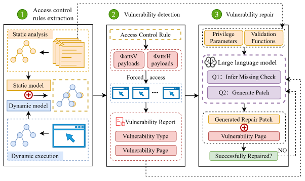

# DRHL

DRHL is a research prototype for cross-language detection and repair of server-side broken access-control vulnerabilities in web applications. It combines multi-role dynamic execution, static source analysis, Hybrid Site Navigation Graph (HSNG) construction, active exploit validation, access-control snippet extraction, and LLM-guided patch generation.

The implementation accompanies the paper:

> DRHL: Cross-Language Detection and Repair of Access Control Vulnerabilities via Hybrid Analysis and LLMs.

DRHL is intended for controlled research and testing environments. Do not run it against production systems or databases.

<p align="center">
  
</p>

## What DRHL Does

Given a source-available web application and a set of user roles, DRHL:

1. Crawls the application with Selenium under multiple roles.
2. Restores the database after each role to avoid crawl-induced state pollution.
3. Builds a dynamic navigation graph from observed pages, requests, forms, and role-specific behavior.
4. Recursively analyzes the source tree to recover statically reachable pages, component pages, and inter-page dependencies.
5. Fuses dynamic and static information into a Hybrid Site Navigation Graph (HSNG).
6. Generates role-aware attack vectors for vertical, horizontal, authenticated-only, and static-only access-control checks.
7. Validates candidate vulnerabilities using a response-cascade oracle based on redirects, denial markers, invalid-resource markers, response status, and configured public-page rules.
8. Extracts validated access-control snippets from PHP, Java/JSP, Python, and Go source code.
9. Uses a two-stage LLM repair workflow to infer the missing authorization constraint and synthesize a complete patched source file.
10. Validates generated patches with syntax checks, exploit-blocking checks, and regression checks, then restores the original application state.

## Repository Layout

```text
drhl/
  analysis/              attack-vector generation and active validation
  crawling/              Selenium crawler, URL normalization, request/form capture
  graphs/                dynamic graph, static graph, and HSNG fusion
  repair/                two-stage LLM repair, patch materialization, validation
  *_source_analysis.py   language-specific CST-based access-control extraction
  cli.py                 command-line interface
  config.py              JSON configuration loading and validation
  database.py            MySQL, SQLite, PostgreSQL/command-style snapshots
  pipeline.py            end-to-end orchestration

configs/                 example application configurations
database_recovery/       optional database baseline capture/restore helpers
docs/                    additional notes and placeholder figures
examples/                minimal configuration templates
tests/                   unit and offline integration tests
requirements.txt         pinned Python dependencies used in our environment
pyproject.toml           package metadata and console entry point
```

Runtime outputs are written to `runs/<application>/` by default and are intentionally not part of the source package.

## Requirements

DRHL was developed and tested on Windows with Python 3.9+ and Chrome/ChromeDriver. The core Python dependencies are listed in `requirements.txt`; the installable package metadata is in `pyproject.toml`.

Required components:

- Python 3.9 or later.
- Google Chrome and a compatible ChromeDriver, or Selenium Manager if available in your environment.
- A test deployment of the target web application.
- A database account that can dump and restore the test database.
- Optional: an OpenAI-compatible LLM endpoint for repair generation.

Install DRHL in a fresh environment:

```powershell
conda create -n drhl python=3.11 -y
conda activate drhl
pip install -r requirements.txt
pip install -e .
```

If you prefer not to install the package in editable mode, run commands with:

```powershell
python -m drhl --help
```

After editable installation, the equivalent command is:

```powershell
drhl --help
```

## Quick Start with SCARF

This section shows a minimal end-to-end run using SCARF as the example target. The exact paths and credentials must match your local deployment.

### 1. Prepare SCARF

Deploy SCARF under your local web root, for example:

```text
http://localhost/scarf/
D:/phpStudy/PHPTutorial/WWW/scarf
```

Prepare a dedicated MySQL database, for example:

```text
Database: scarf
User: root
Password: root
```

DRHL will create a baseline dump before crawling and restore the database after each role and after repair validation. Use only a disposable test database.

### 2. Check the SCARF Configuration

The example configuration is:

```text
configs/scarf.json
```

Important fields:

```json
{
  "run_dir": "../runs/scarf",
  "target": {
    "base_url": "http://localhost/scarf/",
    "source_root": "D:/phpStudy/PHPTutorial/WWW/scarf",
    "language": "php"
  },
  "database": {
    "driver": "mysql",
    "host": "127.0.0.1",
    "port": 3306,
    "database": "scarf",
    "user": "root",
    "password": "env:DRHL_SCARF_DB_PASSWORD"
  }
}
```

DRHL supports environment-variable secrets with the `env:NAME` syntax. For open-source use, avoid committing real API keys, passwords, or private credentials.

Example:

```powershell
$env:DRHL_SCARF_DB_PASSWORD = "root"
$env:DRHL_DEEPSEEK_API_KEY = "your-api-key"
```

The repair LLM configuration can use any OpenAI-compatible endpoint:

```json
"repair": {
  "enabled": true,
  "llm": {
    "enabled": true,
    "provider": "openai_compatible",
    "base_url": "https://api.deepseek.com/v1",
    "model": "deepseek-v4-flash",
    "api_key": "env:DRHL_DEEPSEEK_API_KEY",
    "temperature": 0.1,
    "timeout": 120,
    "response_format_json": true
  }
}
```

If you only want to test detection, set `repair.enabled` to `false`.

### 3. Validate the Configuration

```powershell
python -m drhl validate --config configs/scarf.json
```

Expected output:

```text
configuration is valid: .../configs/scarf.json
```

### 4. Run the Complete Pipeline

```powershell
python -m drhl run --config configs/scarf.json
```

The pipeline performs dynamic crawling, static analysis, HSNG construction, attack-vector generation, active validation, and optional repair.

For a repair-only rerun after detection has already completed:

```powershell
python -m drhl repair --config configs/scarf.json
```

For source-analysis debugging, optionally save the CST representation:

```powershell
python -m drhl analyze-source --config configs/scarf.json --save-cst
```

## Outputs

A normal run creates the following artifacts under `runs/<application>/`:

```text
runs/<application>/
  run.json
  database/baseline.*
  crawl/<role>.json
  graphs/dynamic.json
  graphs/static.json
  graphs/fused.json
  graphs/summary.json
  graphs/summary.csv
  source/candidate_parameters.json
  source/candidate_functions.json
  source/parameters.json
  source/functions.json
  source/snippets.json
  source/cst.json                 # only when CST saving is enabled
  analysis/vectors.json
  analysis/findings.json
  analysis/vulnerability_report.md
  repair/manifest.json
  repair/repair_report.md
  repair/files/...
  repair/prompts/...
  repair/validation/...
  metrics/summary.json
  metrics/summary.csv
```

The most useful files for inspection are:

- `graphs/fused.json`: the final HSNG.
- `analysis/vectors.json`: generated attack vectors.
- `analysis/vulnerability_report.md`: confirmed vulnerable and non-vulnerable pages.
- `source/snippets.json`: validated access-control snippets used by the repair module.
- `repair/repair_report.md`: patch-generation attempts and validation outcomes.
- `metrics/summary.csv`: construction, detection, extraction, LLM, and total runtime metrics.

## Configuration Overview

A DRHL configuration contains five main sections:

| Section | Purpose |
| --- | --- |
| `target` | Base URL, source root, language, and public source extensions. |
| `database` | Snapshot and restore backend. MySQL and SQLite are supported directly; command-based recovery can be used for other systems. |
| `crawl` | Selenium mode, root URL, role credentials, URL scope, URL normalization, form execution, and source-directory exclusions. |
| `analysis` | Source-analysis rules, access-control database fields, oracle settings, public-page rules, horizontal override values, and active-detection options. |
| `repair` | LLM endpoint, decoding parameters, output directory, syntax checking, and runtime validation settings. |

### Roles

Each role must declare a `kind`:

```json
{
  "name": "user1",
  "kind": "user",
  "crawl_login": { "url": "login.php", "fields": {} },
  "http_login": { "url": "login.php", "method": "POST", "data": {} }
}
```

Supported role kinds are:

- `admin`: privileged user.
- `user`: authenticated non-admin user.
- `visitor`: unauthenticated user.

Multiple users can share the same role kind. This is required for horizontal access-control testing.

### Database Snapshots

DRHL assumes the target is a disposable test deployment. Before dynamic crawling, DRHL creates a database baseline. It restores the database:

- after each role finishes crawling;
- after active validation when configured to restore at the end of all attack vectors;
- after repair validation;
- after abnormal termination paths where recovery is possible.

This design prevents Selenium form submission, payload replay, and patch validation from permanently polluting the test database.

### URL Normalization and Form Execution

During crawling, DRHL normalizes dynamic URL fragments to reduce redundant exploration. Numeric IDs, UUID-like values, hash-like values, and most query values are replaced with the placeholder `p1`; control-flow parameters such as `action` can be preserved through `crawl.preserve_query_parameters`.

DRHL can execute forms to trigger server-side logic. Field values are generated from type-aware rules and application-specific secret parameters are redacted from artifacts unless explicitly disabled.

## Reproducing the Paper-Style Evaluation

The paper evaluates DRHL on 16 source-available applications written in PHP, Java/JSP, Python, and Go. The repository includes configuration templates for these applications under `configs/`.

| Application | Version in paper | Language | Upstream link |
| --- | --- | --- | --- |
| AWCMs | 2.1 | PHP | [AWCM: AR Web Content Manager](http://awcm.sourceforge.net) |
| Phpoll | 097beta | PHP | [PHPOLL: PHP-MySQL Poll System](http://phpoll.sourceforge.net) |
| Phpns | 2.1.1 alpha | PHP | [phpns: PHP News System](https://sourceforge.net/projects/phpns/) |
| bWAPP | 2.2 | PHP | [bWAPP: A Buggy Web Application](https://sourceforge.net/projects/bwapp/) |
| DVWA | 1.9 | PHP | [DVWA: Damn Vulnerable Web Application](https://dvwa.co.uk/) |
| SCARF | 1.0 | PHP | [SCARF: Stanford Conference And Research Forum](https://sourceforge.net/projects/scarf/) |
| EventsLister | 2.03 | PHP | Source included in `datasets/events_lister/` because the original upstream link is no longer available. |
| MyBB | 1.6.7 | PHP | [MyBB](https://mybb.com/) |
| WackoPicko | 1.0 | PHP | [WackoPicko](https://github.com/adamdoupe/WackoPicko) |
| Jspblog | 0.1 | Java/JSP | [JSPBLOG](https://sourceforge.net/projects/jspblog/) |
| JsForum | 0.1 | Java/JSP | [JsForum](https://sourceforge.net/projects/jsforum/) |
| jwaBlogger | 1.3.2 | Java | [jwaBlogger](https://sourceforge.net/projects/jwablogger/) |
| DjangoBlog | 1.0 | Python | [Django_blog](https://github.com/TheAbhijeet/Django_blog) |
| django_lms | 1.0.0 | Python | [Django-LMS / SkyLearn](https://github.com/SkyCascade/SkyLearn) |
| BBS_Pro | 1.0 | Python | [BBS_Pro](https://github.com/Superbeet/BBS_Pro) |
| orangeforum | 2.3.0 | Go | [orangeforum](https://github.com/s-gv/orangeforum) |

A typical workflow for each application is:

```powershell
python -m drhl validate --config configs/<application>.json
python -m drhl run --config configs/<application>.json
```

For fair experiments, run each application in an isolated local test deployment and ensure the database recovery script or snapshot backend matches the target database engine.

## Testing the Framework

Run the offline unit tests:

```powershell
python -m unittest discover -s tests -v
python -m compileall -q drhl tests
```

These tests do not require a live web application. They cover URL normalization, graph construction, attack-vector generation, detection boundaries, database recovery behavior, source-analysis extraction, and repair artifact generation.

## Safety Notes

- Run DRHL only on applications you own or are authorized to test.
- Use disposable test databases. DRHL intentionally submits forms and attack payloads.
- Do not commit real API keys, passwords, browser profiles, or production database dumps.
- Review generated patches before applying them to any maintained codebase.
- LLM repair quality depends on the available source context, extracted snippets, and validation configuration.

## Citation

If you use DRHL in academic work, please cite the accompanying paper. The final BibTeX entry will be added after publication.

```bibtex
@article{drhl,
  title  = {DRHL: Cross-Language Detection and Repair of Access Control Vulnerabilities via Hybrid Analysis and LLMs},
  author = {Zhang, Bing and Liu, Hongliang and Ren, Rong and Wang, Qian and Ren, Jiadong},
  journal = {To appear},
  year   = {2026}
}
```

## License

Add the project license here before public release.

